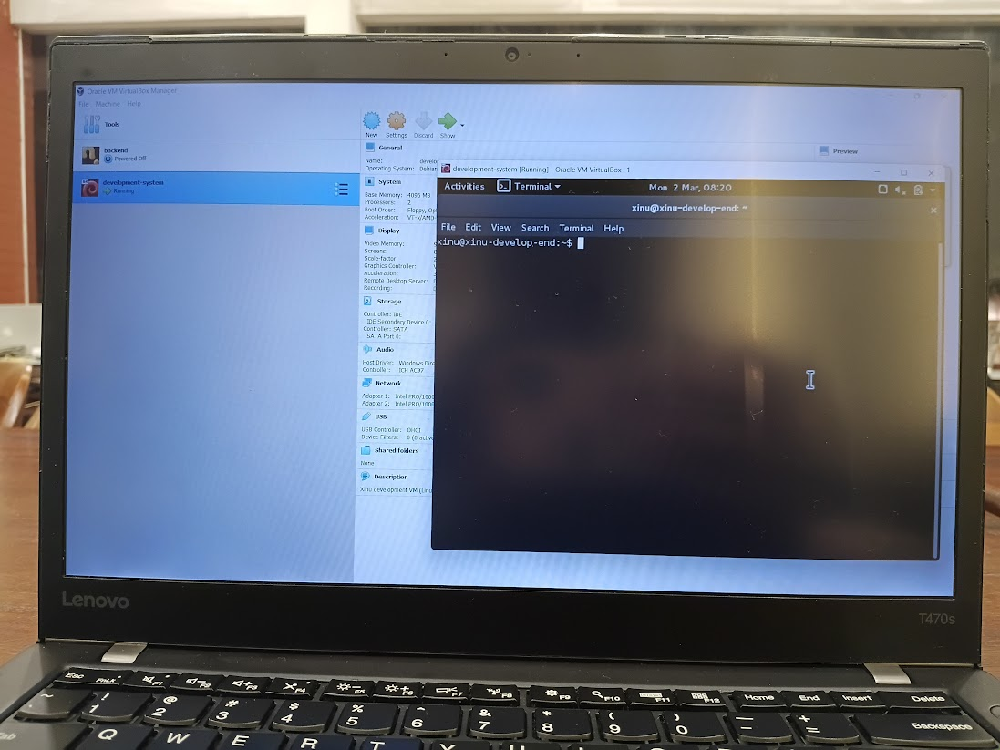

# <h1 align="center">Laporan Praktikum Modul 01   Running Modul</h1>

Marsella Dwi Julianti - 2311104004

## Dasar Teori

Sistem operasi merupakan perangkat lunak inti yang berfungsi untuk mengelola sumber daya komputer serta menjadi perantara antara perangkat keras dan pengguna. Sistem operasi mengatur berbagai hal seperti proses, memori, dan perangkat input/output agar sistem dapat berjalan dengan stabil dan efisien.

Pada Modul 01, praktikum difokuskan pada pengenalan aturan praktikum serta tools yang akan digunakan selama perkuliahan praktikum Sistem Operasi. Salah satu sistem operasi yang digunakan adalah Xinu, yaitu sistem operasi sederhana yang dirancang untuk keperluan pembelajaran konsep dasar sistem operasi.

Selain itu, praktikan juga diperkenalkan dengan penggunaan mesin virtual menggunakan Oracle VM VirtualBox. VirtualBox digunakan untuk menjalankan sistem operasi Ubuntu serta lingkungan Xinu tanpa harus menginstalnya langsung pada sistem utama. Pada modul ini, praktikan memastikan bahwa seluruh tools pendukung seperti VirtualBox, Xinu, Ubuntu, dan Sourcetrail telah terpasang dan dapat dijalankan dengan baik sebagai persiapan untuk modul-modul selanjutnya.

## Guided

Pada sesi praktikum Modul 01, dilakukan beberapa langkah berikut:

1. Memastikan Oracle VM VirtualBox telah terpasang pada komputer.
2. Memastikan file Xinu tersedia sesuai dengan instruksi modul.
3. Menjalankan sistem operasi Ubuntu melalui VirtualBox.
4. Asisten praktikum menjelaskan fitur dasar VirtualBox yang akan digunakan pada praktikum selanjutnya.

Screenshot menjalankan Ubuntu pada VirtualBox:  
Ubuntu VirtualBox 

## Referensi

1. https://en.wikipedia.org/wiki/Operating_system (diakses 2 Maret 2026)  
2. Modul Praktikum Sistem Operasi