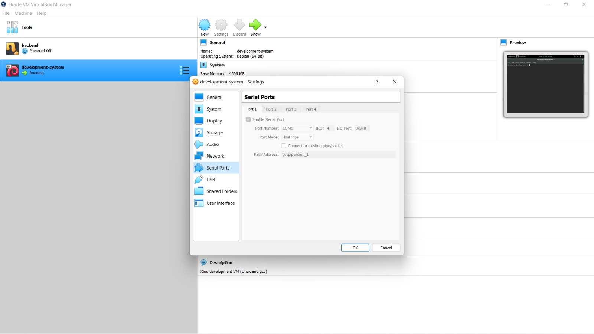
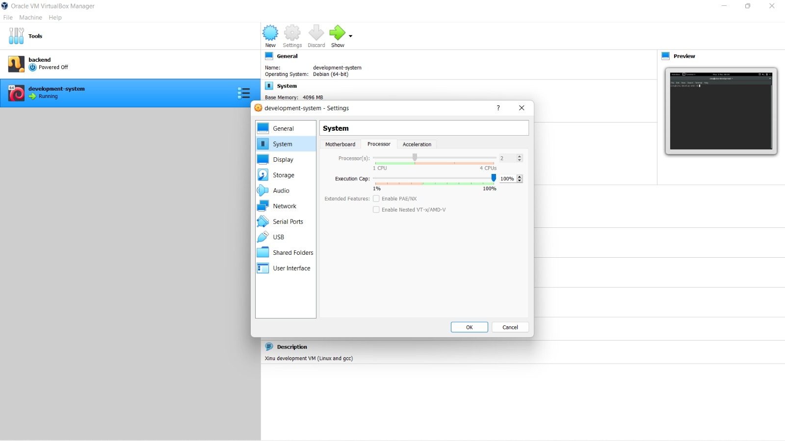
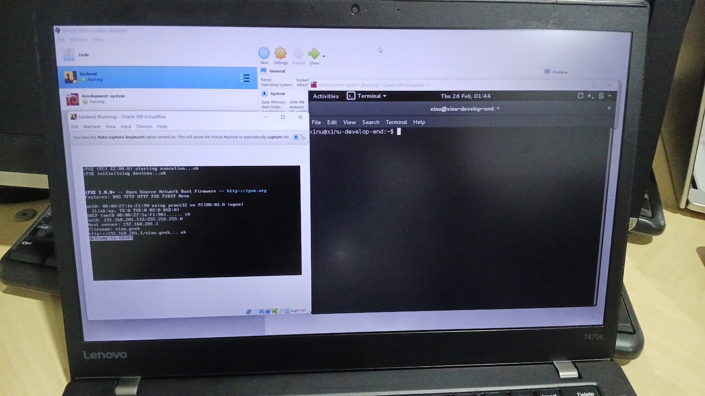

# <h1 align="center">Laporan Praktikum Modul 02   Instalasi Xinu</h1>

Marsella Dwi Julianti - 2311104004

## Dasar Teori

Modul 02 membahas proses instalasi serta konfigurasi lingkungan sistem operasi Xinu. Xinu merupakan sistem operasi ringan yang digunakan untuk pembelajaran dan dikembangkan dengan konsep cross-development, yaitu sistem operasi dikembangkan pada satu komputer dan dijalankan pada komputer lain sebagai target.

Dalam praktikum ini digunakan dua mesin virtual, yaitu development-system dan backend. Development-system merupakan mesin virtual berbasis Linux Debian yang berisi source code Xinu, compiler, serta layanan jaringan seperti DHCP dan TFTP. Mesin ini digunakan sebagai lingkungan pengembangan dan kompilasi Xinu.

Sementara itu, backend berfungsi sebagai mesin target yang akan menjalankan sistem operasi Xinu. Backend tidak memiliki sistem operasi secara langsung, melainkan melakukan booting melalui jaringan menggunakan protokol PXE untuk mengambil file sistem dari development-system. Dengan arsitektur ini, praktikan dapat memahami alur kerja sistem operasi dari proses pengembangan hingga eksekusi.

## Guided

Langkah-langkah yang dilakukan pada Modul 02 adalah sebagai berikut:

1. Mengekstrak file xinu-vbox-appliances.tar.gz sehingga diperoleh file development-system.ova dan backend.ova.
2. Mengimpor development-system.ova ke Oracle VM VirtualBox dan melakukan pengaturan jaringan, serial port, dan display sesuai modul.
3. Mengimpor backend.ova dan melakukan pengaturan jaringan serta serial port agar terhubung dengan development-system.
4. Menjalankan development-system dan backend untuk memastikan backend dapat melakukan booting melalui jaringan.

Screenshot pengaturan Development-System:  
Development System Setting
Development System Setting

Screenshot backend berhasil dijalankan:  
Backend Running

## Referensi

1. Modul Praktikum Sistem Operasi  
2. https://en.wikipedia.org/wiki/Virtual_machine (diakses 2 Maret 2026)