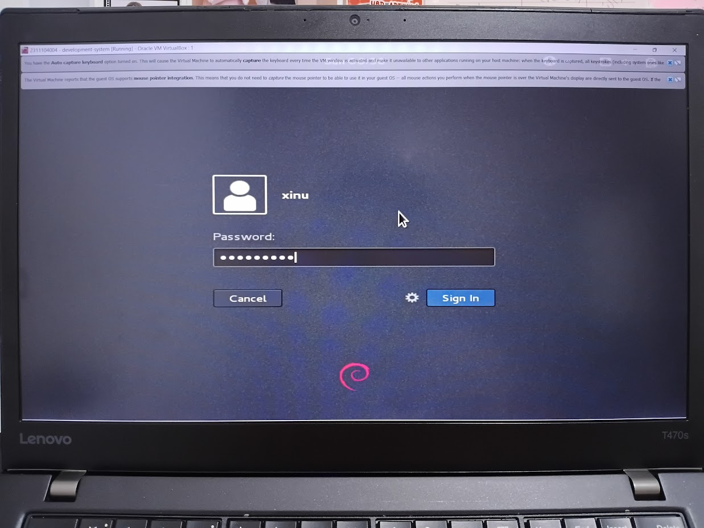
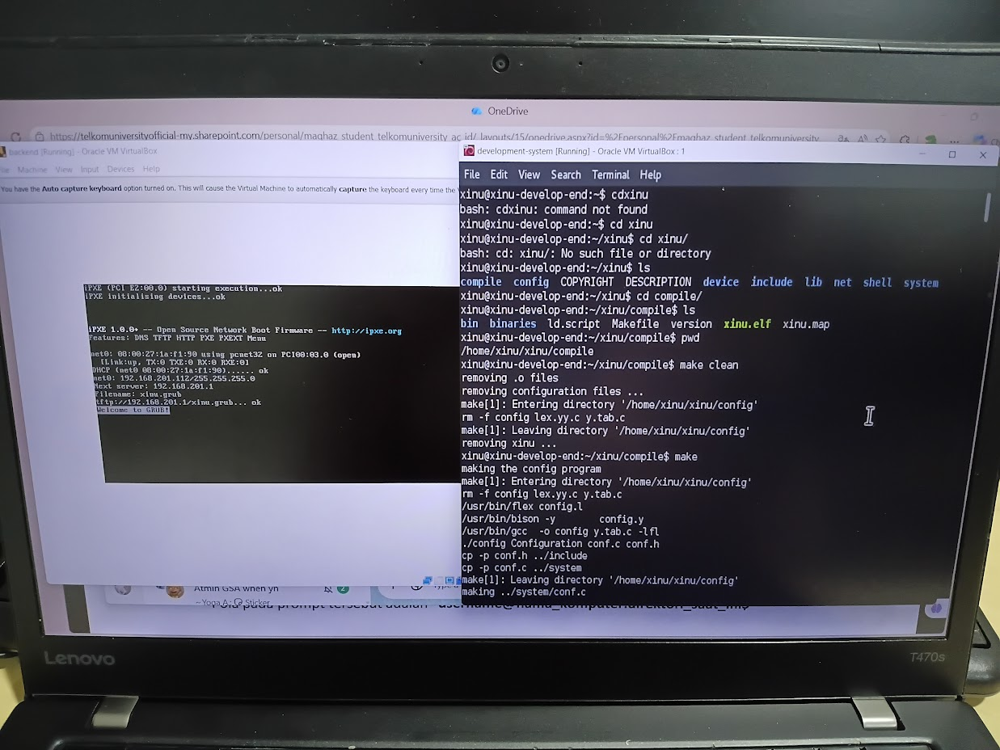
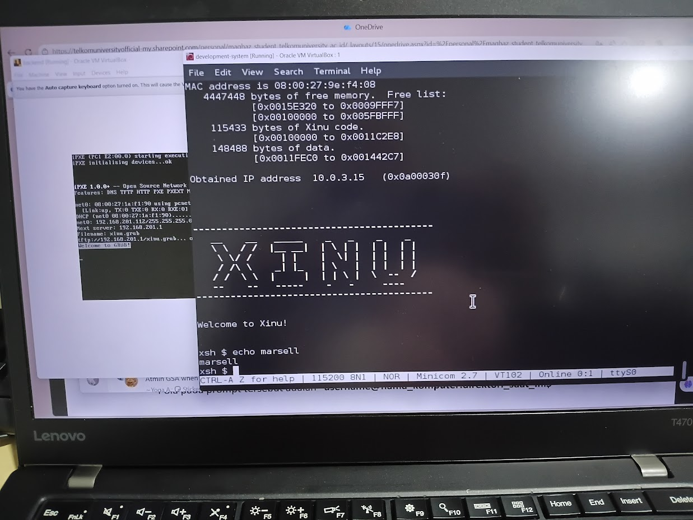
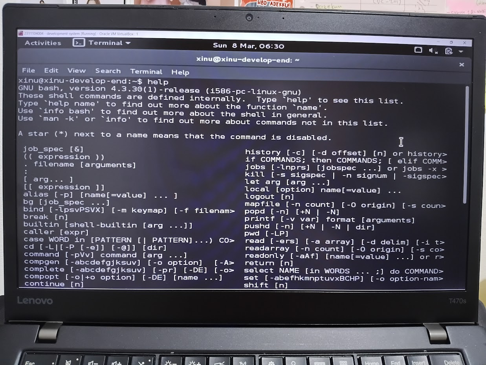
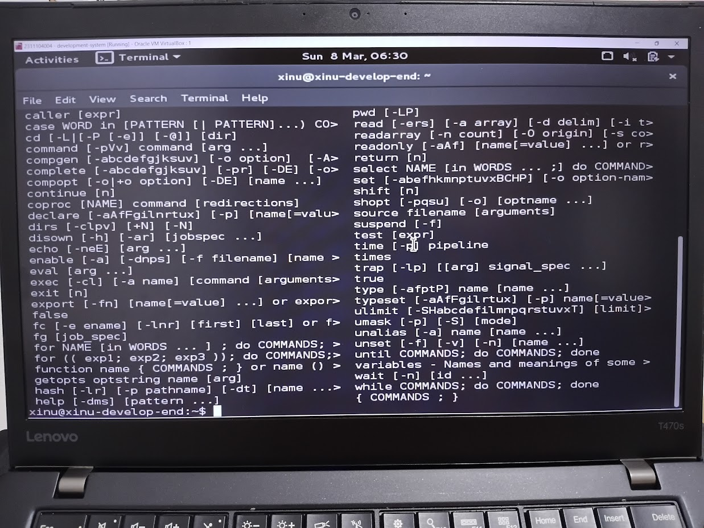
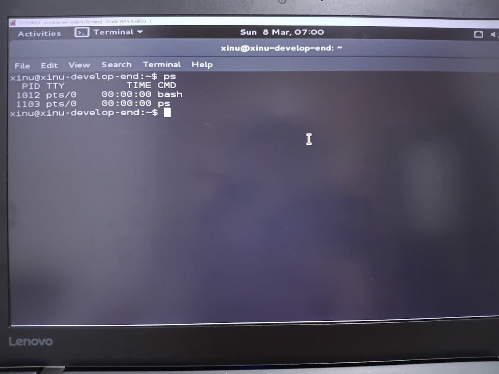
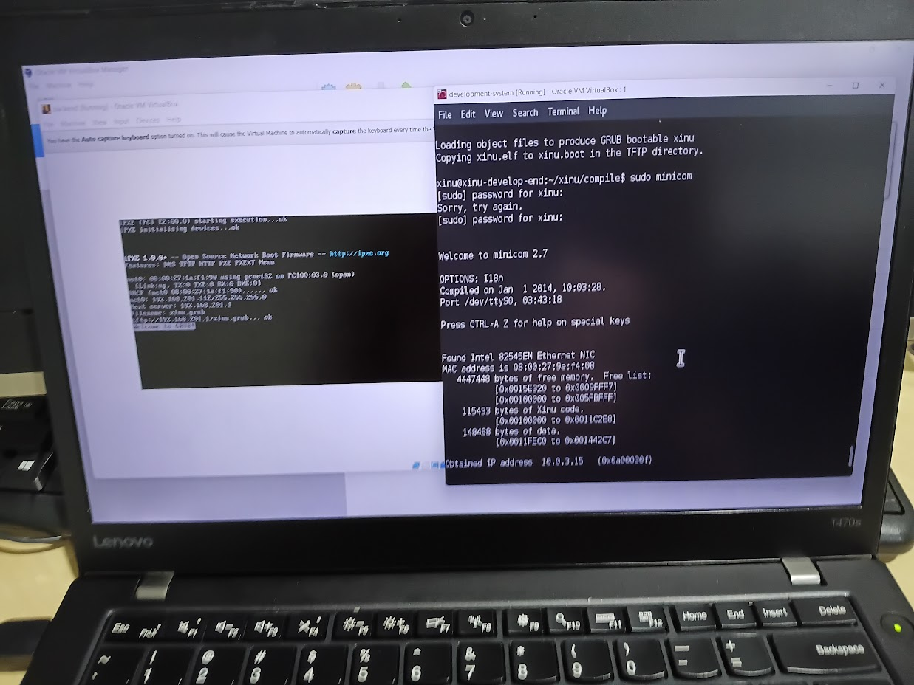

# <h1 align="center">Laporan Praktikum Modul 03 <br> Eksplorasi Xinu</h1>
<p align="center">Marsella Dwi Julianti - 2311104004</p>

## Dasar Teori

Modul 03 membahas cara menjalankan dan mengeksplorasi sistem operasi Xinu. Xinu (Xinu Is Not Unix) merupakan sistem operasi ringan yang dirancang untuk tujuan pendidikan. Xinu dikembangkan menggunakan konsep cross-development, di mana proses pengembangan dilakukan pada satu mesin (development-system) dan dijalankan pada mesin lain (backend).

Dalam arsitektur Xinu, terdapat dua Virtual Machine yang digunakan. Development-system menjalankan Linux dan berisi source code Xinu, compiler, serta layanan jaringan seperti DHCP server dan TFTP server. Backend VM merupakan mesin target yang tidak memiliki OS sendiri, melainkan melakukan booting melalui jaringan menggunakan protokol PXE untuk mengambil image Xinu dari development-system.

Shell Xinu (dengan prompt `xsh$`) merupakan antarmuka baris perintah yang memungkinkan pengguna berinteraksi dengan sistem operasi Xinu. Melalui shell ini, pengguna dapat mengeksekusi berbagai perintah untuk mengelola proses, melihat konfigurasi jaringan, serta menjalankan utilitas sistem lainnya.

## Guided

### 3.1 — Menjalankan Xinu

Langkah-langkah yang dilakukan untuk menjalankan Xinu:

1. Menjalankan VirtualBox kemudian Start **development-system** VM.
2. Login pada development-system menggunakan:
   - username: **xinu**
   - password: **xinurocks**
3. Setelah login berhasil, muncul terminal berikut:

   <!-- SS 1: Screenshot terminal setelah login ke development-system (seperti Gambar 3-1 di modul) -->
   Login Xinu

4. Mengetikkan perintah berikut pada terminal untuk berpindah ke direktori compile:
   ```
   $ cd xinu/compile
   ```

5. Menjalankan perintah `make clean` untuk menghapus image Xinu OS yang ada sebelumnya (memastikan xinu yang akan dikompilasi merupakan versi terbaru):
   ```
   $ make clean
   ```

6. Menjalankan perintah `make` untuk mengompilasi source code Xinu menjadi image (`xinu.elf`). Image ini kemudian juga dicopy sebagai `xinu.boot` pada folder server TFTP (`/srv/tftp/`):
   ```
   $ make
   ```

7. Menjalankan Minicom untuk berkomunikasi dengan backend VM melalui serial port:
   ```
   $ sudo minicom
   ```
   Jika diminta password, gunakan: **xinurocks**

8. Beralih ke **Backend VM**. Menjalankan VirtualBox kemudian **Start** virtual machine backend. Tunggu hingga muncul pesan "Welcome to GRUB". Jika pesan tersebut muncul berarti Xinu telah berhasil dijalankan pada backend VM.

   <!-- SS 2: Screenshot backend VM menampilkan "Welcome to GRUB" (seperti Gambar 3-6 di modul) -->
   Hasil Running Backend Xinu

9. Kembali ke terminal pada **development-system**. Jika tidak ada masalah, maka akan muncul tampilan Xinu berhasil berjalan:

   <!-- SS 3: Screenshot terminal development-system menampilkan Xinu running dengan logo XINU dan "Welcome to Xinu!" (seperti Gambar 3-8 di modul) -->
   Hasil Running Xinu

10. Sekarang prompt berubah menjadi `xsh$`, menandakan kita sedang berinteraksi dengan Xinu yang ada pada backend VM.

---

### 3.2 — Eksplorasi Xinu (Tugas 1)

Setelah Xinu berhasil berjalan, dilakukan eksplorasi terhadap perintah-perintah yang tersedia pada Shell Xinu. Perintah `help` digunakan untuk menampilkan semua perintah yang tersedia.

```
xsh$ help
```

<!-- SS 4: Screenshot hasil perintah "help" pada shell Xinu yang menampilkan daftar semua perintah -->
Hasil perintah help
Hasil perintah help

Berikut adalah daftar perintah yang tersedia pada Shell Xinu beserta fungsinya:

| No | Perintah       | Fungsi                                                                 |
|----|----------------|------------------------------------------------------------------------|
| 1  | `argecho`      | Menampilkan kembali argumen yang diberikan oleh pengguna               |
| 2  | `cat`          | Menampilkan isi dari sebuah file                                       |
| 3  | `clear`        | Membersihkan layar terminal                                            |
| 4  | `date`         | Menampilkan tanggal dan waktu saat ini                                 |
| 5  | `devdump`      | Menampilkan informasi tentang device yang terdaftar pada sistem        |
| 6  | `echo`         | Menampilkan teks atau string yang diberikan ke layar                   |
| 7  | `exit`         | Keluar dari shell Xinu                                                 |
| 8  | `help`         | Menampilkan daftar semua perintah yang tersedia pada Shell Xinu        |
| 9  | `kill`         | Menghentikan (terminate) sebuah proses berdasarkan PID-nya             |
| 10 | `memdump`      | Menampilkan isi memori (memory dump) dari sistem                       |
| 11 | `memstat`      | Menampilkan statistik penggunaan memori sistem                         |
| 12 | `ps`           | Menampilkan daftar proses yang sedang berjalan beserta informasinya    |
| 13 | `sleep`        | Menunda eksekusi selama jumlah detik tertentu                          |
| 14 | `uptime`       | Menampilkan waktu berapa lama sistem telah berjalan                    |
| 15 | `?`            | Menampilkan daftar perintah (fungsi sama dengan `help`)                |

---

### Tugas 2 — Menjawab Pertanyaan

<!-- SS 5: Screenshot hasil perintah "ps" pada shell Xinu yang menampilkan daftar proses -->
Hasil perintah ps

Berikut adalah jawaban dari pertanyaan-pertanyaan pada Modul 03:

**1. Berapa jumlah perintah pada Xinu?**

Terdapat **15 perintah** yang tersedia pada Shell Xinu (termasuk `?` yang merupakan alias dari `help`).

---

**2. Sebutkan 2 perintah yang mempunyai fungsi yang sama!**

Perintah `help` dan `?` memiliki fungsi yang sama, yaitu menampilkan daftar semua perintah yang tersedia pada Shell Xinu.

---

**3. Berapa IP address Xinu?**

IP address Xinu adalah **192.168.1.101** (sesuai konfigurasi DHCP pada development-system).

<!-- SS 6: Screenshot hasil perintah yang menampilkan IP address Xinu (misal dari devdump) -->
IP Address Xinu

---

**4. Perintah apa yang digunakan untuk mengetahui IP address?**

Perintah yang digunakan untuk mengetahui IP address pada Xinu adalah **`devdump`**, yang menampilkan informasi device termasuk konfigurasi jaringan.

---

**5. Berapa IP DNS server yang digunakan oleh Xinu?**

IP DNS server yang digunakan oleh Xinu adalah **192.168.1.100** (sesuai konfigurasi DNS pada development-system).

---

**6. Terdapat berapa proses yang sedang berjalan pada Xinu?**

Berdasarkan output perintah `ps`, terdapat **5 proses** yang sedang berjalan pada Xinu.

---

**7. Proses apa yang mempunyai prioritas paling rendah?**

Proses yang mempunyai prioritas paling rendah adalah **prnull** (null process) dengan prioritas **0**.

---

**8. Proses apa yang mempunyai ukuran paling besar?**

Proses yang mempunyai ukuran (stack size) paling besar adalah **Main** dengan ukuran **8192 bytes**.

---

**9. Proses apa yang berada dalam state current?**

Proses yang berada dalam state **current** adalah **shell** (proses shell yang sedang aktif digunakan).

---

**10. Proses apa yang berada dalam state suspend?**

Proses yang berada dalam state **suspend** adalah **rdsin** dan **rdsout** (proses remote disk input dan output).

---

**11. Berapa PID (Process ID) dari Main process?**

PID dari Main process adalah **1**.

---

### Catatan Penting — Cara Keluar dari Minicom

1. Tekan tombol **Ctrl + A** secara bersamaan, lalu lepaskan. Kemudian tekan huruf **X**. Akan muncul konfirmasi untuk keluar, pilih **Yes**.
2. Jika Xinu mengalami hang atau masalah:
   - Matikan Backend VM terlebih dahulu.
   - Keluar dari Minicom pada development-system (tutup terminal atau gunakan cara di atas).
   - Jalankan kembali Minicom: `sudo minicom`.
   - Nyalakan kembali Backend VM.
   - Jika masih bermasalah, restart development-system juga.

## Referensi

1. Modul Praktikum Sistem Operasi  
2. Comer, D. E. (2015). *Operating System Design: The Xinu Approach*. CRC Press.  
3. https://xinu.cs.purdue.edu/ (diakses 8 Maret 2026)