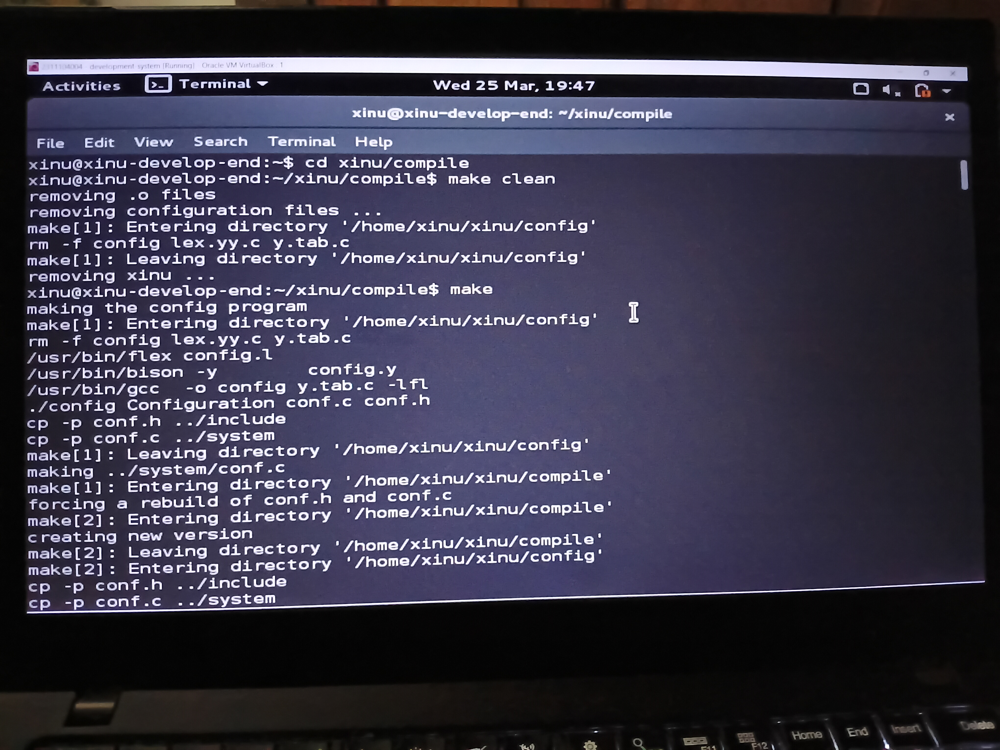
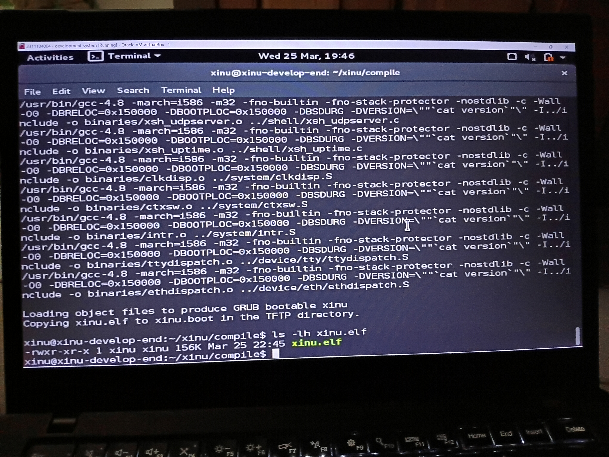

# Laporan Praktikum Modul 04
## Membaca Source Code Xinu

<p align="center">Marsella Dwi Julianti - 2311104004</p>

---

## Dasar Teori

Modul 04 membahas cara membaca dan memahami struktur source code sistem operasi Xinu, serta melakukan modifikasi sederhana pada kode tersebut. Xinu (Xinu Is Not Unix) adalah sistem operasi ringan yang dikembangkan untuk tujuan pendidikan oleh Douglas Comer di Purdue University.

Source code Xinu memiliki struktur yang terorganisasi dengan baik. Beberapa direktori penting dalam struktur source code Xinu antara lain: direktori `include/` yang berisi file-file header (.h), direktori `shell/` yang berisi implementasi shell Xinu, serta direktori `compile/` yang digunakan untuk proses kompilasi.

Sourcetrail merupakan perangkat lunak yang digunakan untuk mengeksplorasi source code secara visual. Dengan Sourcetrail, programmer dapat menelusuri hubungan antar fungsi, variabel, dan struktur data dalam sebuah proyek perangkat lunak. Hal ini sangat membantu dalam memahami alur program dan arsitektur sistem operasi seperti Xinu.

Struktur data proses dalam Xinu mendefinisikan semua informasi yang dibutuhkan sistem untuk mengelola setiap proses, seperti nama proses, status, prioritas, stack pointer, dan informasi lainnya. Modifikasi pada welcome banner Xinu dilakukan dengan mengedit file header dan file source code pada direktori shell, kemudian dikompilasi ulang agar perubahan dapat terlihat saat sistem dijalankan.

---

## Guided

### Soal 1 — Image Hasil Kompilasi Xinu

Setelah melakukan kompilasi pada Xinu menggunakan perintah `make`, image yang dihasilkan adalah **`xinu.elf`**. File image tersebut tersimpan pada folder **`compile/`** di dalam direktori xinu. Selain itu, image juga dicopy sebagai `xinu.boot` ke folder TFTP server (`/srv/tftp/`) agar dapat di-boot oleh backend VM melalui jaringan.

> 📸 **Screenshot 1** — Jalankan perintah `make` pada terminal development-system, lalu screenshot tampilan terminal yang menunjukkan proses kompilasi selesai dan file `xinu.elf` berhasil dibuat. Pastikan terlihat nama user/hostname (contoh: `xinu@development-system`).



Ukuran file `xinu.elf` dapat dilihat menggunakan perintah berikut pada direktori `xinu/compile`:

```
$ ls -lh xinu.elf
```

> 📸 **Screenshot 2** — Screenshot hasil perintah `ls -lh xinu.elf` yang menampilkan nama file beserta ukurannya di direktori `xinu/compile`.



---

### Soal 2 — Membaca Source Code Xinu dengan Sourcetrail

Langkah-langkah yang dilakukan untuk membaca source code Xinu menggunakan Sourcetrail:

1. Membuka aplikasi Sourcetrail pada PC. Jika belum ada, download terlebih dahulu dari link yang tersedia di LMS.
2. Download file source code Xinu yang tersedia pada LMS.
3. Menjalankan Sourcetrail dan membuat project baru: **Project → New Project**.
4. Mengisi nama project dengan "xinu" dan menentukan lokasi penyimpanan project.
5. Memilih **Add Source Groups → C → Empty C Source Group**.
6. Pada **File & Directories to Index**: memasukkan semua folder Xinu yang telah didownload.
7. Pada **Include Paths**: menambahkan path `.../xinu/include`.
8. Klik **Create** dan tunggu proses indexing selesai.
9. Eksplorasi source code Xinu menggunakan Sourcetrail.

> 📸 **Screenshot 3** — Screenshot tampilan Sourcetrail saat konfigurasi project (langkah pengisian nama project, source group, dan include path).

)

> 📸 **Screenshot 4** — Screenshot tampilan Sourcetrail setelah indexing selesai dan saat mengeksplorasi salah satu file/fungsi pada source code Xinu.

)

---

### Soal 3 — Struktur Data Proses pada Xinu OS

Struktur data dari proses pada Xinu OS terdapat pada file **`proc.h`** yang berada di dalam direktori `xinu/include/`. File ini dapat ditemukan menggunakan perintah grep sebagai berikut:

```
$ grep -r "struct procent" /path/ke/xinu/include
```

> 📸 **Screenshot 5** — Screenshot hasil perintah `grep` pada terminal yang menampilkan lokasi ditemukannya `struct procent` beserta nama file `proc.h`.

)

Struktur data proses dalam Xinu OS bernama `struct procent`. Informasi yang disimpan dalam struktur data tersebut antara lain:

| No | Field | Keterangan |
|----|-------|------------|
| 1 | `prstate` | Status/state dari proses (PRFREE, PRCURR, PRREADY, dll.) |
| 2 | `prprio` | Prioritas proses yang menentukan urutan penjadwalan |
| 3 | `prstkptr` | Stack pointer yang menunjuk ke posisi stack proses saat ini |
| 4 | `prstkbase` | Alamat dasar (base) dari stack proses |
| 5 | `prstklen` | Ukuran (panjang) dari stack proses |
| 6 | `prname` | Nama proses dalam bentuk string karakter |
| 7 | `prsem` | Semaphore yang sedang ditunggu oleh proses |
| 8 | `prparent` | PID dari proses induk (parent process) |
| 9 | `prretval` | Nilai kembalian dari proses (return value) |
| 10 | `prnxtkin` | PID proses berikutnya dalam antrian penjadwalan |

> 📸 **Screenshot 6** — Screenshot isi file `proc.h` yang menampilkan keseluruhan `struct procent` beserta field-field di dalamnya (buka file menggunakan text editor atau jalankan `cat proc.h` di terminal).

)

---

### Soal 4 — Mengubah Welcome Banner pada Xinu

#### 4a. Mencari File yang Menyimpan Banner Xinu

File yang menyimpan banner Xinu adalah **`xinu.h`**, yang berada di direktori `xinu/include/`. File ini berekstensi `.h` (header file) dan berisi definisi teks banner yang ditampilkan saat Xinu dijalankan.

> 📸 **Screenshot 7** — Screenshot isi file `xinu.h` (gunakan `cat xinu.h` atau buka di text editor) yang menampilkan bagian definisi banner/string ASCII art Xinu **sebelum** dimodifikasi.

)

#### 4b. Mencari File yang Menampilkan Banner Xinu

File yang menampilkan banner Xinu adalah **`xsh_banner.c`**, yang berada di direktori `xinu/shell/`. File ini berekstensi `.c` (source code C) dan berisi fungsi yang memanggil dan mencetak banner saat shell Xinu diinisialisasi.

> 📸 **Screenshot 8** — Screenshot isi file `xsh_banner.c` yang menampilkan fungsi pemanggil banner **sebelum** dimodifikasi.

)

#### 4c. Modifikasi Welcome Banner

Welcome banner Xinu diubah dengan menambahkan nama, NIM, dan tampilan banner sesuai kreasi sendiri. Berikut adalah bagian source code yang dimodifikasi:

```c
/* Nama  : Marsella Dwi Julianti
 * NIM   : 2311104004
 * Kelas : ...
 */
```

> 📸 **Screenshot 9** — Screenshot isi file `xinu.h` **setelah dimodifikasi**, menampilkan banner baru yang sudah ditambahkan nama, NIM, dan kreasi sendiri. Pastikan comment identitas terlihat di bagian atas kode.

)

> 📸 **Screenshot 10** — Screenshot isi file `xsh_banner.c` **setelah dimodifikasi**, menampilkan perubahan yang dilakukan pada fungsi banner.

)

#### 4d. Kompilasi Ulang dan Menjalankan Xinu

Setelah melakukan modifikasi pada banner, dilakukan kompilasi ulang dengan perintah-perintah berikut:

```
$ cd xinu/compile
$ make clean
$ make
$ sudo minicom
```

Kemudian Backend VM dijalankan untuk melihat hasil perubahan banner.

> 📸 **Screenshot 11** — Screenshot hasil perintah `make clean` pada terminal yang menampilkan proses pembersihan file hasil kompilasi sebelumnya.

)

> 📸 **Screenshot 12** — Screenshot hasil perintah `make` yang menampilkan proses kompilasi ulang berjalan hingga selesai tanpa error.

)

> 📸 **Screenshot 13** — Screenshot tampilan Minicom/Backend VM yang menampilkan **welcome banner Xinu yang baru** hasil modifikasi, lengkap dengan nama dan NIM yang sudah ditambahkan.

)

---

## Referensi

1. Modul Praktikum Sistem Operasi Modul 04: Membaca Source Code Xinu
2. Comer, D. E. (2015). *Operating System Design: The Xinu Approach*. CRC Press.
3. Sourcetrail Documentation — https://github.com/CoatiSoftware/Sourcetrail (diakses Maret 2026)
4. https://xinu.cs.purdue.edu/ (diakses Maret 2026)