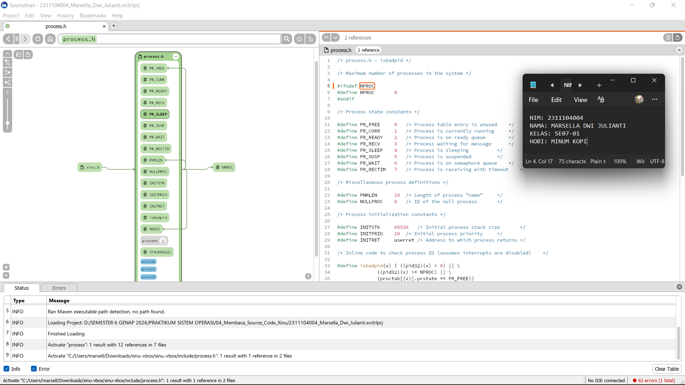
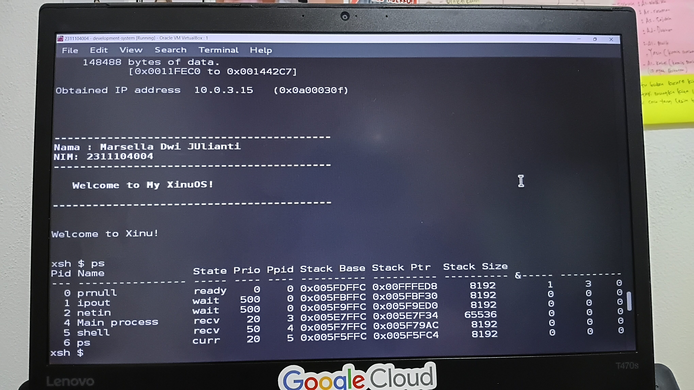
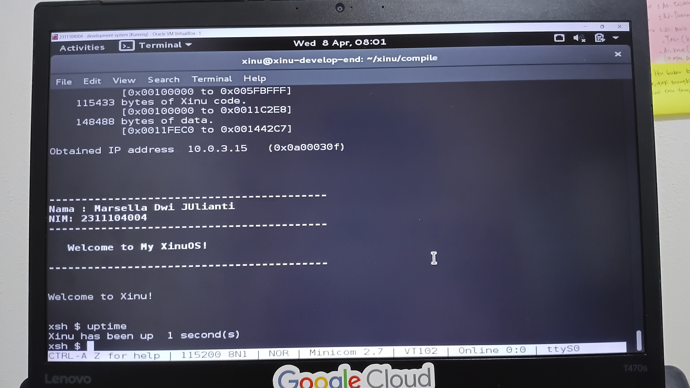

# Laporan Praktikum Modul 05
## Eksplorasi Proses

Marsella Dwi Julianti - 2311104004

---

## Dasar Teori

Sistem operasi memiliki peran penting dalam mengatur jalannya proses di dalam komputer. Proses merupakan program yang sedang dieksekusi, dan setiap proses memiliki informasi yang disimpan dalam struktur yang disebut Process Control Block (PCB). PCB berisi informasi seperti ID proses, state proses, prioritas, register, serta informasi lain yang dibutuhkan untuk mengelola proses tersebut.

Pada sistem operasi Xinu, manajemen proses menjadi salah satu konsep utama yang dipelajari. Xinu menyediakan berbagai struktur data dan fungsi untuk mengelola proses, seperti pembuatan proses, penjadwalan, serta komunikasi antar proses melalui mekanisme message passing.

Setiap proses dalam Xinu memiliki beberapa state, seperti running, ready, waiting, dan lainnya, yang menunjukkan kondisi proses tersebut saat dijalankan oleh sistem operasi. Selain itu, Xinu juga menyediakan perintah seperti ps untuk melihat daftar proses yang sedang berjalan, serta uptime untuk mengetahui lamanya sistem telah berjalan sejak booting.

Pada Modul 05 ini, praktikan melakukan eksplorasi lebih dalam terhadap proses di Xinu dengan cara membaca, memahami, serta memodifikasi source code yang berkaitan dengan manajemen proses. Praktikan juga melakukan perubahan pada perintah ps untuk menampilkan informasi tambahan serta memodifikasi perintah uptime agar menampilkan waktu dalam satuan menit.

---

## Guided

Berikut Pada praktikum Modul 05 menampilkan struktur procent dan proctab:

---

## Unguided

### 🔹 Soal 1

Berdasarkan hasil analisis pada file `process.h` menggunakan tools Sourcetrail, diperoleh informasi sebagai berikut:

a. Jumlah maksimum proses pada Xinu adalah **8**, yang ditunjukkan oleh konstanta `NPROC`.

b. Panjang maksimal nama suatu proses adalah **16 karakter**, yang ditunjukkan oleh konstanta `PNMLEN`.

c. Nilai prioritas awal saat proses dibuat adalah **20**, yang ditunjukkan oleh konstanta `INITPRIO`.

d. Total state pada Xinu berjumlah **8 state**, yaitu:
- `PR_FREE` → proses tidak digunakan
- `PR_CURR` → proses sedang berjalan
- `PR_READY` → proses siap dijalankan
- `PR_RECV` → proses menunggu pesan
- `PR_SLEEP` → proses sedang tidur
- `PR_SUSP` → proses ditangguhkan
- `PR_WAIT` → proses menunggu resource
- `PR_RECTIM` → proses menerima dengan timeout

---

### 🔹 Soal 2

Pada percobaan ini dilakukan analisis terhadap file `xsh_ps.c` yang merupakan implementasi dari perintah `ps` pada Xinu.

Berdasarkan 20 baris terakhir source code, diperoleh pemahaman sebagai berikut:

- Program melakukan iterasi terhadap seluruh proses yang ada pada sistem menggunakan loop.
- Setiap proses diakses melalui struktur `proctab`.
- Pointer `prptr` digunakan untuk menunjuk ke data proses tertentu.
- Program mengecek apakah proses aktif sebelum ditampilkan.
- Informasi yang ditampilkan meliputi PID, nama proses, state, dan prioritas.
- Fungsi `kprintf()` digunakan untuk mencetak informasi ke layar.
- Output ditampilkan dalam bentuk tabel agar mudah dibaca.
- State proses ditampilkan dalam bentuk nilai yang merepresentasikan kondisi proses.
- Loop berjalan dari indeks 0 hingga `NPROC`.
- Proses yang tidak digunakan tidak akan ditampilkan.
- Program memastikan hanya proses valid yang ditampilkan.
- Format output menggunakan tab (`\t`) agar rapi.
- Data proses diambil langsung dari struktur PCB.
- Program tidak mengubah data, hanya menampilkan informasi.
- Digunakan untuk monitoring proses yang sedang berjalan.
- Membantu dalam debugging sistem operasi.
- Menunjukkan kondisi sistem secara real-time.
- Setelah semua proses ditampilkan, fungsi selesai dijalankan.
- Tidak ada interaksi input dari user.
- Fungsi mengembalikan nilai setelah selesai dieksekusi.

---

### 🔹 Soal 3

Pada percobaan ini dilakukan modifikasi terhadap perintah `ps` dengan menambahkan informasi tambahan berupa kolom **Msg** dan **Content**.

Kolom **Msg** digunakan untuk menunjukkan jumlah atau status pesan pada suatu proses, sedangkan kolom **Content** digunakan untuk menampilkan isi pesan tersebut.

Modifikasi dilakukan pada file `xsh_ps.c` dengan menambahkan bagian output menggunakan fungsi `kprintf()` yang menampilkan nilai `prhasmsg` dan `prmsg` dari struktur proses.

Setelah dilakukan perubahan, sistem Xinu dikompilasi ulang menggunakan perintah:
make clean
make 

Kemudian sistem dijalankan kembali dan dilakukan pengujian menggunakan perintah `ps`. Hasil output menunjukkan bahwa kolom **Msg** dan **Content** berhasil ditambahkan dan ditampilkan dengan benar pada setiap proses.

---

### 🔹 Soal 4

Pada percobaan ini dilakukan modifikasi terhadap perintah `uptime` agar hanya menampilkan waktu dalam satuan menit.

Modifikasi dilakukan pada file `xsh_uptime.c` dengan mengubah perhitungan waktu dari detik menjadi menit, yaitu dengan membagi nilai waktu sistem (`clktime`) dengan 60.

Setelah dilakukan perubahan, sistem dikompilasi ulang menggunakan:
make clean
make

Kemudian dilakukan pengujian dengan menjalankan perintah `uptime`. Output yang dihasilkan menunjukkan waktu sejak sistem booting dalam satuan menit sesuai dengan yang diharapkan.

---
## Referensi

1. Modul Praktikum Sistem Operasi Modul 04: Membaca Source Code Xinu
2. Comer, D. E. (2015). *Operating System Design: The Xinu Approach*. CRC Press.
3. Sourcetrail Documentation — https://github.com/CoatiSoftware/Sourcetrail (diakses Maret 2026)
4. https://xinu.cs.purdue.edu/ (diakses Maret 2026)