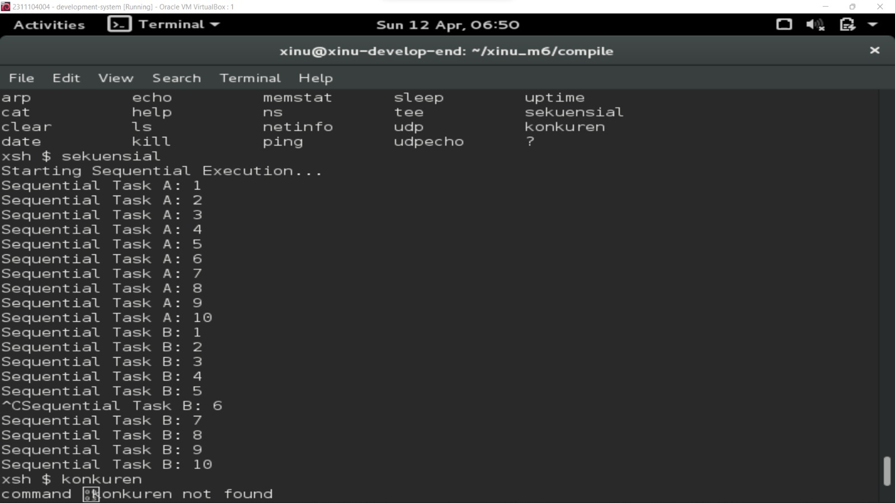
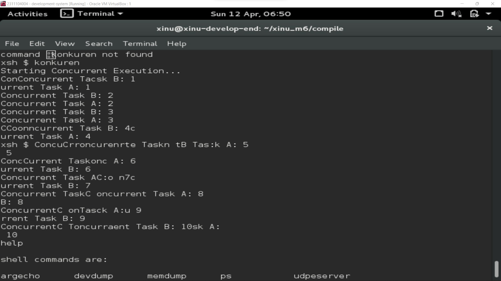
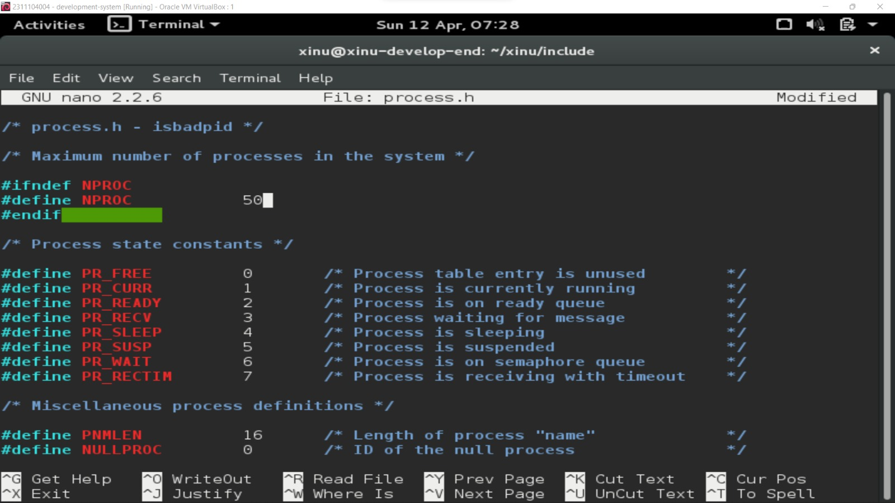
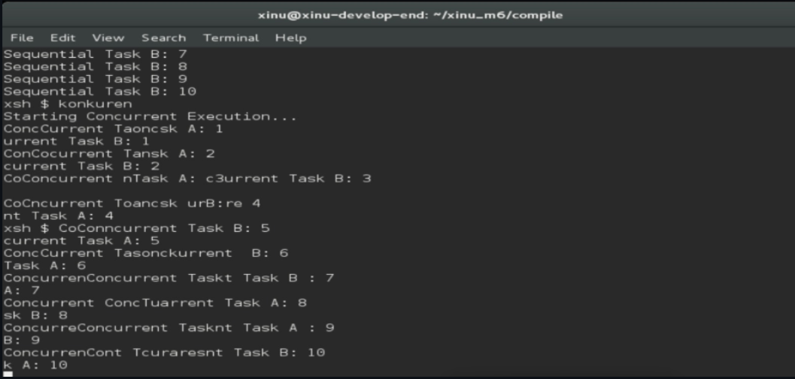
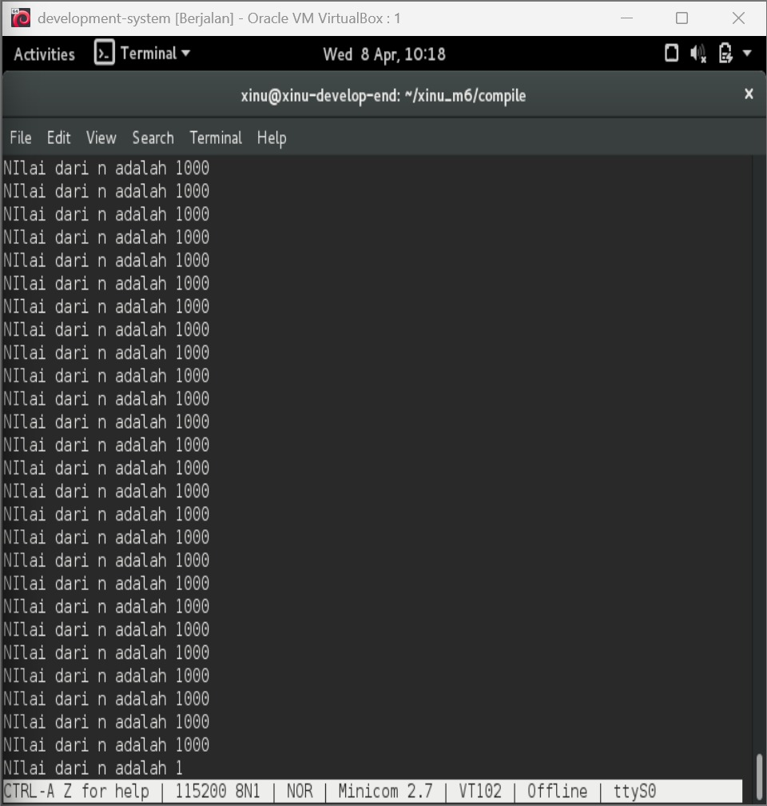
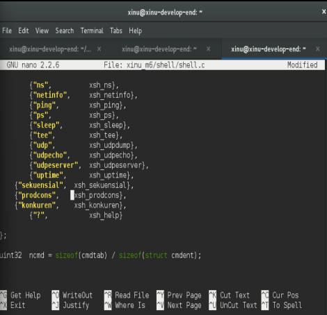
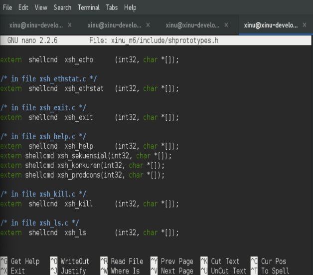

# LAPORAN PRAKTIKUM MODUL 06
## Sekuensial dan Konkuren Program

<p align="center">Marsella Dwi Julianti - 2311104004</p>

---

## Dasar Teori

Sistem operasi tidak hanya menjalankan satu proses saja, tetapi mampu menjalankan banyak proses secara bersamaan. Dalam konteks ini, terdapat dua konsep utama yaitu proses sekuensial dan proses konkuren.

Proses sekuensial adalah proses yang berjalan secara berurutan, dimana satu instruksi akan dijalankan setelah instruksi sebelumnya selesai. Dalam model ini, hanya terdapat satu alur eksekusi sehingga tidak ada proses yang berjalan secara bersamaan.

Sebaliknya, proses konkuren memungkinkan beberapa proses berjalan secara bersamaan. Pada sistem dengan satu CPU, hal ini dicapai melalui teknik multitasking, yaitu dengan membagi waktu eksekusi CPU ke beberapa proses secara cepat sehingga terlihat berjalan secara paralel.

Dalam sistem operasi Xinu, proses konkuren dapat dibuat menggunakan system call seperti `create()` untuk membuat proses baru dan `resume()` untuk menjalankan proses tersebut. Dengan pendekatan ini, Xinu mampu menjalankan beberapa proses secara bergantian dalam waktu yang sangat cepat.

Konsep konkuren ini sangat penting dalam pengembangan sistem operasi karena memungkinkan efisiensi penggunaan CPU serta mendukung berbagai aplikasi yang berjalan secara bersamaan.

---

## Guided

### 🔹 Sekuensial

Berikut merupakan hasil eksekusi program sekuensial pada Xinu:



Berdasarkan hasil di atas, terlihat bahwa proses berjalan secara berurutan. Program menjalankan **Task A terlebih dahulu hingga selesai**, kemudian dilanjutkan dengan **Task B**. Hal ini menunjukkan bahwa tidak ada proses yang berjalan secara bersamaan.

---

### 🔹 Konkuren

Berikut merupakan hasil eksekusi program konkuren pada Xinu:



Pada proses konkuren, output yang dihasilkan tidak berurutan seperti pada sekuensial. Hal ini terjadi karena beberapa proses dijalankan secara bersamaan menggunakan `create()` dan `resume()` sehingga eksekusi proses saling bergantian (interleaving).

---

## Unguided

### 🔹 Soal 1

Berdasarkan analisis pada source code Xinu di file `process.h`, batas maksimum jumlah proses ditentukan oleh konstanta `NPROC`.

Nilai default maksimum proses pada Xinu adalah:

- **50 proses**

Kemudian dilakukan modifikasi dengan mengubah nilai tersebut menjadi:

```c
#define NPROC 150
```



---

### 🔹 Soal 2 (Sekuensial)

Pada percobaan ini dilakukan eksekusi program sekuensial. Program memanggil dua fungsi secara berurutan.

Hasil output menunjukkan bahwa proses pertama dijalankan hingga selesai sebelum proses kedua dimulai. Tidak terjadi interleaving antar proses.

Hal ini membuktikan bahwa pada program sekuensial, eksekusi dilakukan secara linear dan tidak ada proses yang berjalan secara bersamaan.


---

### 🔹 Soal 3 (Konkuren)

Pada percobaan ini dilakukan implementasi proses konkuren menggunakan system call `create()` dan `resume()`.

Dua proses dijalankan secara bersamaan sehingga output yang dihasilkan menjadi tidak berurutan.

Hal ini terjadi karena sistem operasi melakukan penjadwalan proses secara bergantian dalam waktu yang sangat cepat, sehingga terlihat seperti berjalan bersamaan.


---

### 🔹 Soal 4 (Produser - Konsumer)

Pada percobaan ini dibuat dua proses yaitu produser dan konsumer dengan menggunakan variabel global:

```c
int32 n = 0;
```



Dibuat dua proses yaitu produser dan konsumer yang menggunakan variabel global int32 n. Produser bertugas menambahkan nilai dari 1 sampai 1000, sedangkan konsumer membaca dan menampilkan nilai tersebut.

Output yang dihasilkan tidak selalu berurutan. Hal ini disebabkan karena kedua proses berjalan secara konkuren, sehingga dieksekusi secara bergantian oleh sistem. Karena tidak ada mekanisme sinkronisasi, kedua proses mengakses variabel n secara bersamaan.

Kondisi ini disebut race condition, yaitu ketika beberapa proses mengakses data yang sama secara bersamaan sehingga hasilnya tidak dapat diprediksi. Akibatnya, nilai yang ditampilkan bisa tidak urut atau tidak sesuai dengan yang diharapkan.

Langkah Pengerjaan:
Masuk ke folder project:
cd xinu_m6
Salin file sekuensial:
cp shell/xsh_sekuensial.c shell/xsh_prodcons.c
Edit file:
gedit shell/xsh_prodcons.c
Isi dengan program produser–konsumer (menggunakan variabel n).
Daftarkan command di shell.c:
{"prodcons", xsh_prodcons},
Tambahkan prototype di shprototypes.h:
extern shellcmd xsh_prodcons(int32, char *[]);
Compile dan jalankan:
cd xinu_m6/compile
make clean
make
sudo minicom
Jalankan:
prodcons




---

## Kesimpulan

Berdasarkan praktikum yang telah dilakukan, dapat disimpulkan bahwa:

1. Proses sekuensial berjalan secara berurutan tanpa adanya proses yang berjalan bersamaan.
2. Proses konkuren memungkinkan beberapa proses berjalan secara bersamaan dengan teknik multitasking.
3. Xinu menyediakan system call seperti `create()` dan `resume()` untuk membuat proses konkuren.
4. Tanpa sinkronisasi, proses konkuren dapat menyebabkan race condition yang menghasilkan output tidak konsisten.

---

## Referensi

1. Modul Praktikum Sistem Operasi Modul 06: Sekuensial dan Konkuren
2. Comer, D. E. (2015). *Operating System Design: The Xinu Approach*
3. Dokumentasi Xinu OS