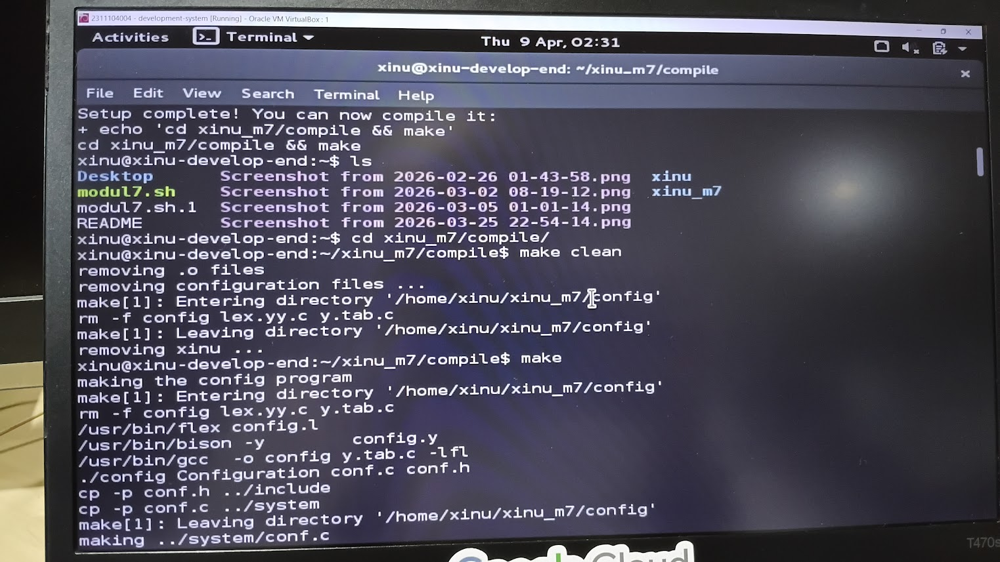
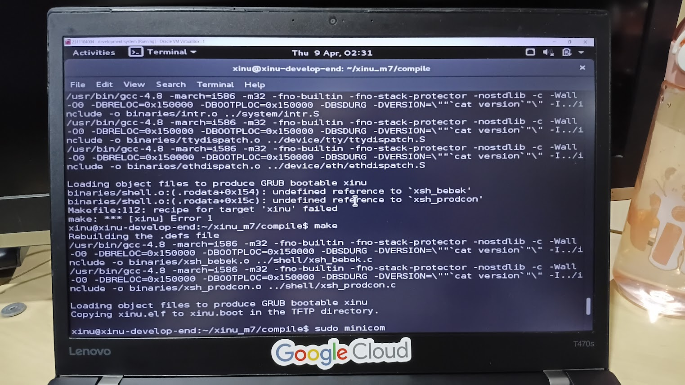
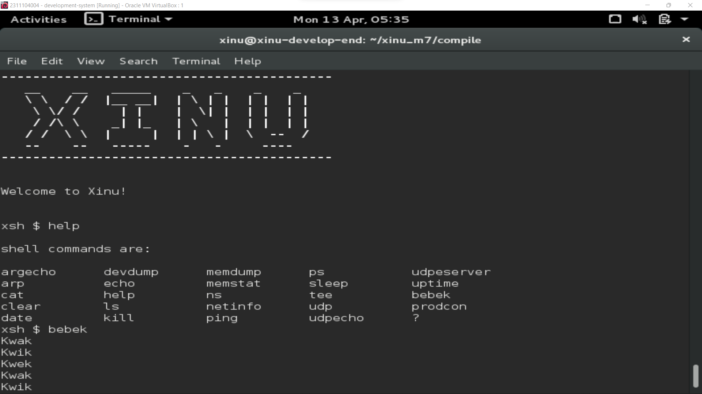
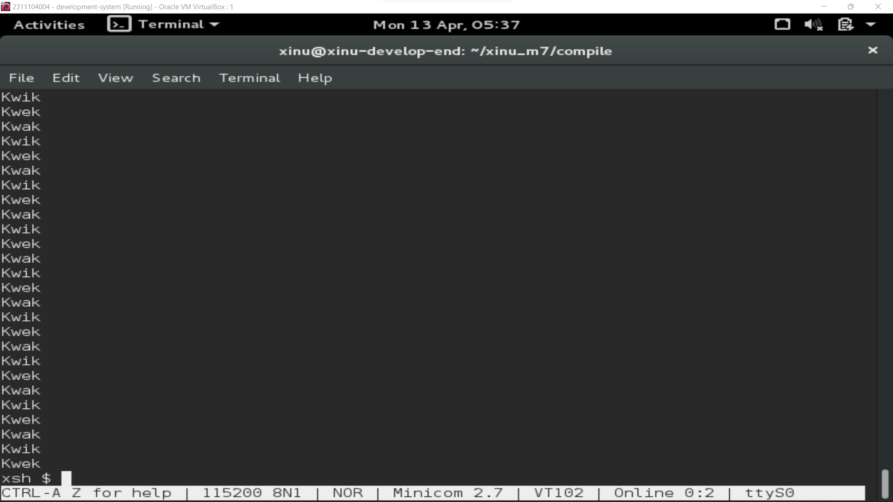
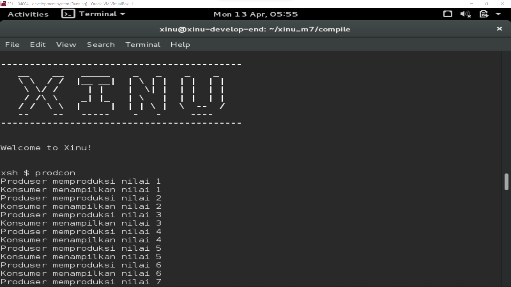
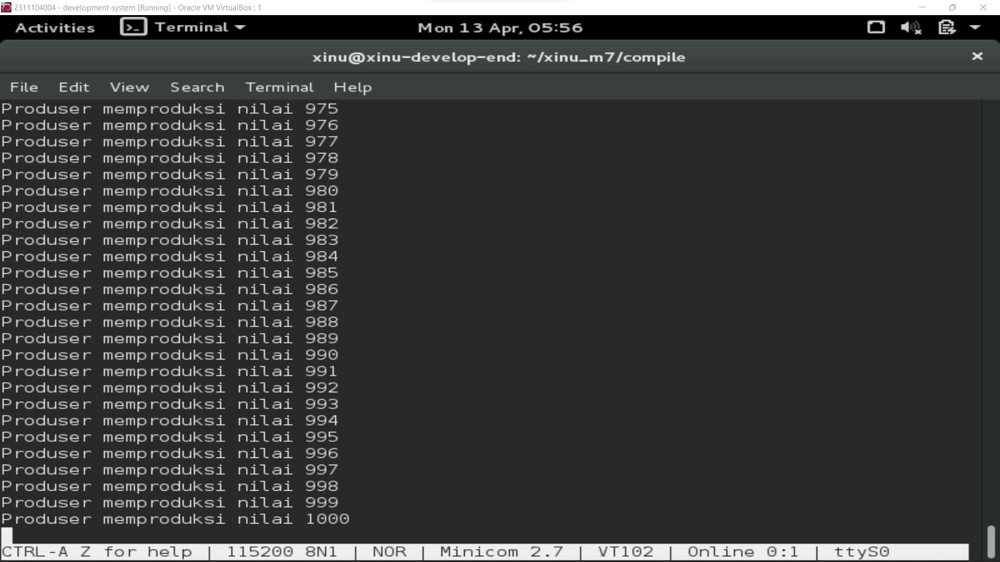

# <h1 align="center">Laporan Praktikum Modul 07 <br> Semaphore</h1>
<p align="center">Marsella Dwi Julianti - 2311104004</p>

## Dasar Teori

Sistem operasi merupakan perangkat lunak inti yang berfungsi mengelola sumber daya komputer serta menjadi perantara antara perangkat keras dan pengguna. Salah satu konsep penting dalam sistem operasi adalah sinkronisasi proses, yaitu mekanisme untuk mengatur urutan eksekusi proses-proses yang berjalan secara konkuren agar tidak terjadi kondisi balapan (*race condition*) atau akses bersamaan terhadap sumber daya bersama.

**Semaphore** adalah salah satu mekanisme sinkronisasi yang diperkenalkan oleh Edsger W. Dijkstra. Semaphore merupakan variabel bertipe integer yang digunakan untuk mengontrol akses terhadap sumber daya bersama dalam lingkungan multiprosesing. Terdapat 3 operasi yang bisa dilakukan pada semaphore, yaitu inisiasi, signal, dan wait.

### Inisiasi

Pada Xinu, inisiasi semaphore dilakukan dengan fungsi `semcreate(nilai_inisiasi)`. Fungsi ini membuat semaphore baru dengan nilai awal yang ditentukan.

```c
sid32 s1, s2;
s1 = semcreate(3); // inisiasi s1 dengan nilai 3
s2 = semcreate(1); // inisiasi s2 dengan nilai 1
```

### Signal

Operasi signal berarti *increment* (menambah 1) nilai semaphore. Jika ada proses yang sedang diblok menunggu semaphore tersebut, maka proses tersebut akan di-*unblock*. Pada Xinu, sintak signal adalah `signal(nama_semaphore)`.

```c
signal(s1); // increment nilai s1
```

### Wait

Operasi wait berarti *decrement* (mengurangi 1) nilai semaphore. Jika nilai semaphore menjadi negatif setelah dikurangi, maka proses yang memanggil `wait` akan diblok hingga proses lain melakukan `signal`. Pada Xinu, sintak wait adalah `wait(nama_semaphore)`.

```c
wait(s1); // decrement nilai s1; jika negatif, proses diblok
```

### Pola Signaling

Pola signaling digunakan untuk memastikan bahwa suatu proses (P1) telah selesai sebelum proses berikutnya (P2) dijalankan. Semaphore P1 diinisiasi dengan 1 (agar langsung bisa berjalan), dan semaphore P2 diinisiasi dengan 0 (agar menunggu sinyal dari P1 terlebih dahulu).

| P1 | P2 |
|---|---|
| wait(s1) | wait(s2) |
| // P1 melakukan sesuatu | // P2 melakukan sesuatu |
| signal(s2) | signal(s1) |

### Pola Mutex

Pola mutex (*mutual exclusion*) digunakan untuk memastikan bahwa suatu variabel atau sumber daya (*critical section*) hanya dapat diakses oleh satu proses pada satu waktu. Mutex selalu diinisiasi dengan nilai 1.

| P1 | P2 |
|---|---|
| wait(m1) | wait(m1) |
| // Critical section | // Critical section |
| signal(m1) | signal(m1) |

---

## Guided

Pada sesi Guided Modul 07, dipelajari cara mengimplementasikan semaphore pada Xinu mencakup tiga operasi dasar (inisiasi, signal, wait), serta dua pola utama yaitu signaling dan mutex.

### 7.1 Operasi Semaphore

Berikut contoh implementasi ketiga operasi semaphore pada Xinu:

```c
// Inisiasi semaphore
sid32 s1, s2;
s1 = semcreate(3);
s2 = semcreate(1);

resume(create(sndA, 1024, 20, "process A", 2, s1, s2));
resume(create(sndB, 1024, 20, "process B", 1, s1));
```

Fungsi `sndB` menunjukkan penggunaan operasi signal:

```c
void sndB(sid32 s1) {
    // nilai s1 = 3
    signal(s1); // nilai s1 menjadi 4
}
```

Fungsi `sndA` menunjukkan penggunaan operasi wait:

```c
void sndA(sid32 s1, sid32 s2) {
    // misalkan nilai s1 = 3; s2 = 0
    wait(s1);   // nilai s1 menjadi 2
    print("A"); // dieksekusi
    wait(s2);   // nilai s2 menjadi -1, proses A diblok
    print("B"); // dieksekusi setelah proses A di-unblock
}
```

### 7.2 Pola Signaling

Contoh implementasi pola signaling untuk memastikan "A" dicetak sebelum "B":

```c
sndA(sid32 s1, sid32 s2) {
    wait(s1);
    print("A");
    signal(s2);
}

sndB(sid32 s1, sid32 s2) {
    wait(s2);
    print("B");
    signal(s1);
}
```

Dengan inisiasi `s1 = semcreate(1)` dan `s2 = semcreate(0)`, pola ini menjamin "A" selalu tercetak sebelum "B".

### 7.3 Pola Mutex

Contoh implementasi pola mutex untuk memproteksi variabel `saldo`:

```c
sid32 mutex;
mutex = semcreate(1); // mutex selalu diinisiasi dengan 1

void sndA(sid32 m1) {
    wait(m1);
    saldo = saldo + setor; // critical section
    signal(m1);
}

void sndB(sid32 m1) {
    wait(m1);
    saldo = saldo + setor; // critical section
    signal(m1);
}
```

Dengan pola ini, hanya satu proses yang dapat mengakses `saldo` pada satu waktu, sehingga tidak terjadi *race condition*.









---

## Unguided

### Soal 1 [50 poin]

Buatlah 3 buah proses yaitu P1, P2, dan P3. P1 selalu menampilkan "Kwak", P2 selalu menampilkan "Kwik", P3 selalu menampilkan "Kwek". Menggunakan 3 proses tersebut dan beberapa buah semaphore, buatlah program yang dapat menampilkan output secara berurutan:

```
Kwak
Kwik
Kwek
Kwak
Kwik
Kwek
...
```

**Jawaban:**

> *[Screenshot source code dan output program]*


### Soal 2 [50 poin]

Buatlah proses bernama `produser` yang memproduksi bilangan 1–1000. Buatlah proses bernama `konsumer` yang akan menampilkan nilai yang diproduksi oleh produser. Gunakan semaphore! Output yang diharapkan:

```
Produser memproduksi nilai 1
Konsumer menampilkan nilai 1
Produser memproduksi nilai 2
Konsumer menampilkan nilai 2
...
Produser memproduksi nilai 1000
Konsumer menampilkan nilai 1000
```

> **Catatan:** Harus menggunakan semaphore, proses konkuren, tidak boleh hanya 1 proses dan hanya menggunakan while loop kemudian print.

**Jawaban:**

> *[Screenshot source code dan output program]*





---

## Referensi

1. Modul Praktikum Sistem Operasi – Modul 7: Semaphore
2. Silberschatz, A., Galvin, P. B., & Gagne, G. (2018). *Operating System Concepts* (10th ed.). Wiley.
3. https://en.wikipedia.org/wiki/Semaphore_(programming) (diakses 13 April 2026)