# <h1 align="center">Laporan Praktikum Modul 09 <br> Syscall</h1>
<p align="center">Marsella Dwi Julianti - 2311104004</p>

---

## Dasar Teori

Syscall (*system call*) adalah interface yang digunakan oleh proses untuk meminta layanan dari sistem operasi. Dengan syscall, proses tidak perlu mengetahui bagaimana implementasi internal OS bekerja, karena semua akan ditangani oleh kernel.

Fungsi utama syscall:
- Sebagai penghubung antara user program dan kernel
- Menyediakan layanan seperti manajemen proses, memori, dan I/O
- Menjaga keamanan melalui mekanisme proteksi dan *information hiding*

Pada Xinu, syscall memiliki alur kerja sebagai berikut:
1. Disable interrupt
2. Validasi parameter
3. Eksekusi layanan
4. Restore interrupt
5. Return hasil

---

## Guided

### 9.1 Implementasi Syscall pada Xinu

Berikut hasil tampilan saat Xinu berhasil dijalankan:

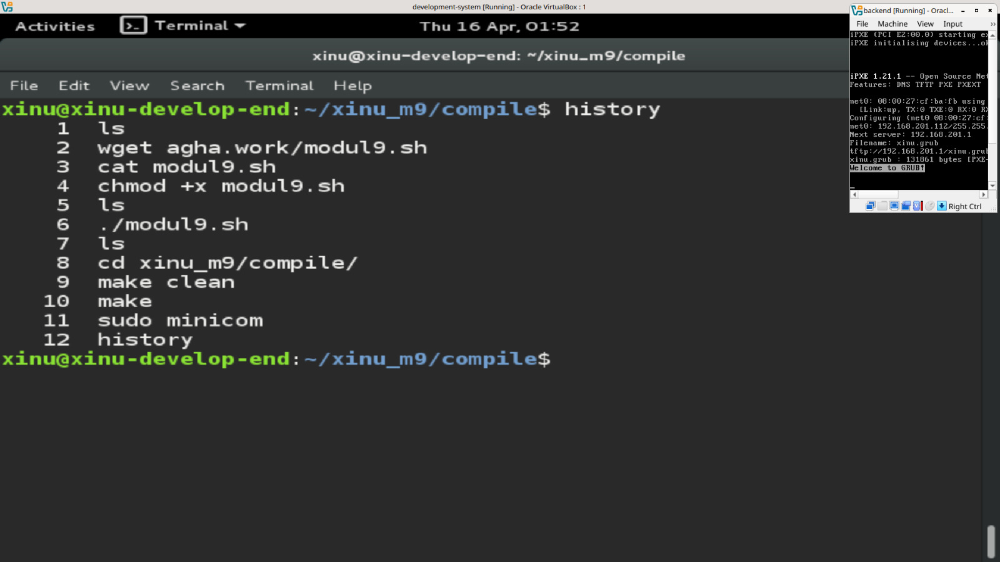

Terlihat bahwa sistem berhasil dijalankan dan perintah seperti help dan uptime dapat digunakan.

---

### 9.2 Proses Compile dan Eksekusi

```bash
make clean
make
sudo minicom
```

Riwayat perintah:

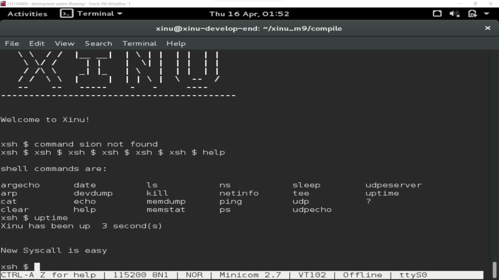

---

## Unguided

### Soal 1

**Penempatan Screenshot:**
- Screenshot kode → taruh setelah bagian kode
- Screenshot hasil run → taruh setelah penjelasan output

Kode syscall (file: `system/chname.c`):

```c
#include <xinu.h>

syscall chname(void) {
    intmask mask;
    mask = disable();

    kprintf("New Syscall is easy\n");

    restore(mask);
    return OK;
}
```

Tambahkan di file `include/prototypes.h`:

```c
extern syscall chname(void);
```

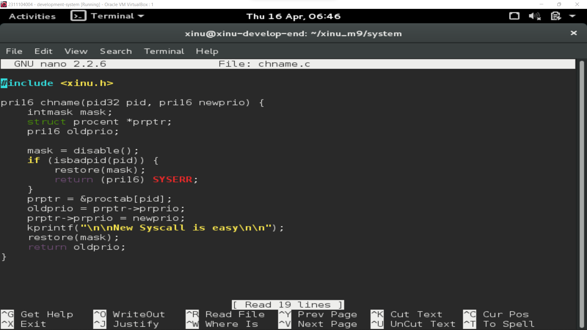

Langkah compile:

```bash
make clean
make
```

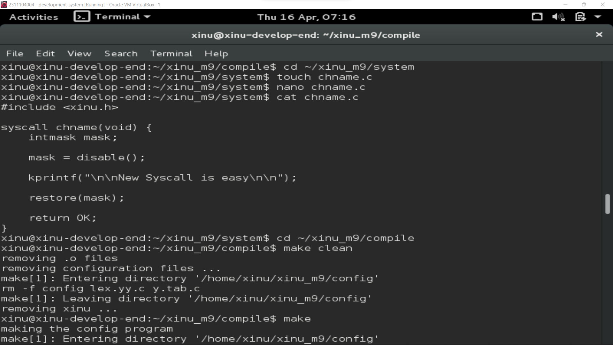

hasil output:

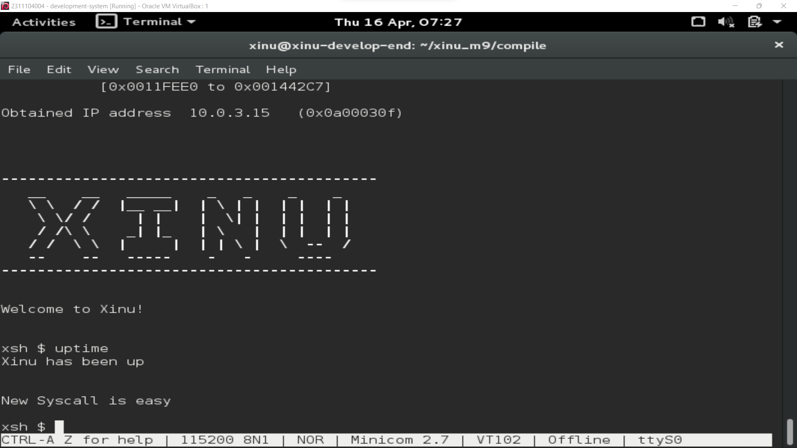

---

### Soal 2

**Penempatan Screenshot:**
- Screenshot kode `chprio.c` → setelah kode
- Screenshot hasil testing → setelah penjelasan

File: `system/chprio.c`

```c
syscall chprio(pid32 pid, pri16 newprio) {
    intmask mask;
    mask = disable();

    if (isbadpid(pid) || newprio <= 0) {
        restore(mask);
        return SYSERR;
    }

    struct procent *prptr;
    prptr = &proctab[pid];
    prptr->prprio = newprio;

    restore(mask);
    return newprio;
}
```

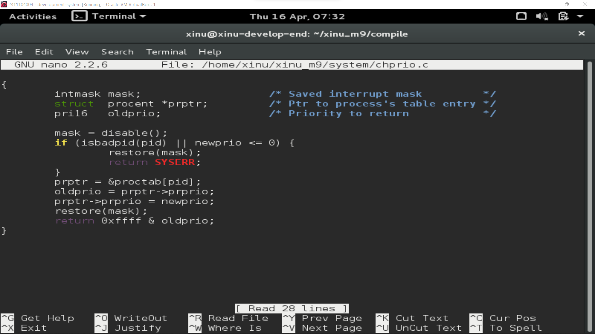

---

### Soal 3

**Penempatan Screenshot:**
- Screenshot sebelum `uptime` (ps pertama)
- Screenshot setelah `uptime` (ps kedua)

Edit file: `shell/xsh_uptime.c`

```c
chprio(5,33);
```

Perintah:

```bash
ps
uptime
ps
```


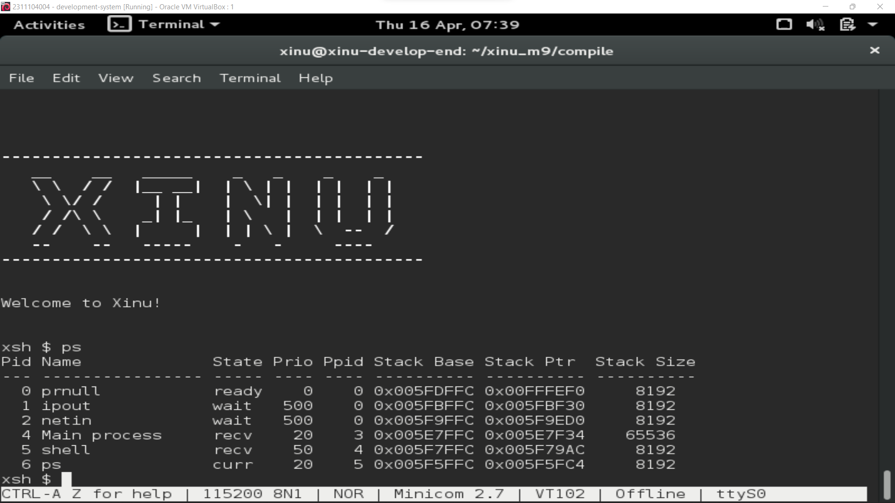

Screenshoot setelah uptime:

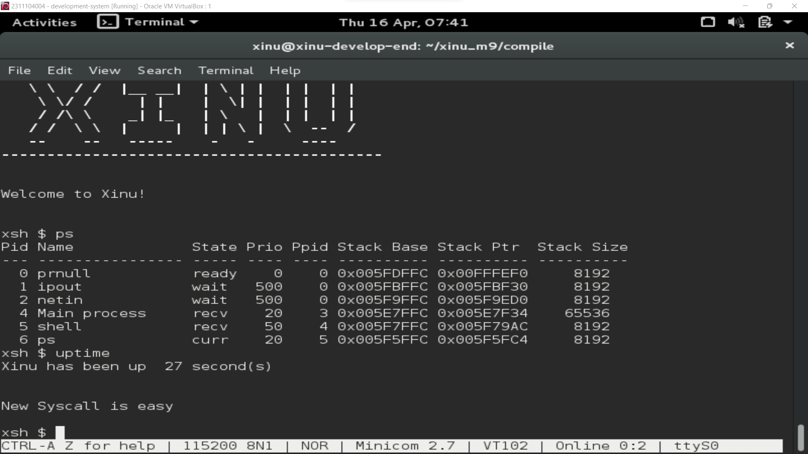

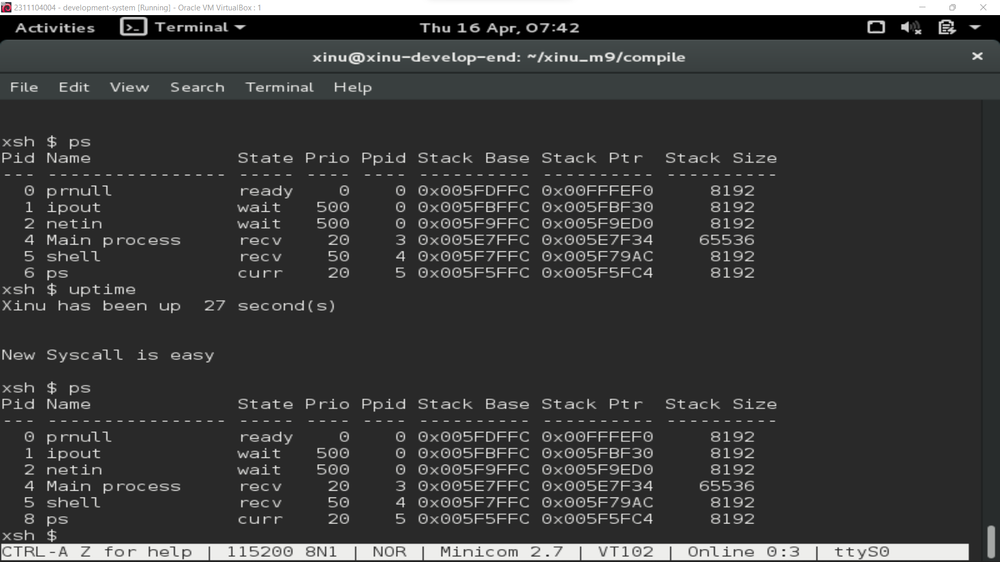

---

### Testing

#### 1. Prioritas negatif

```c
chprio(5,-3);
```

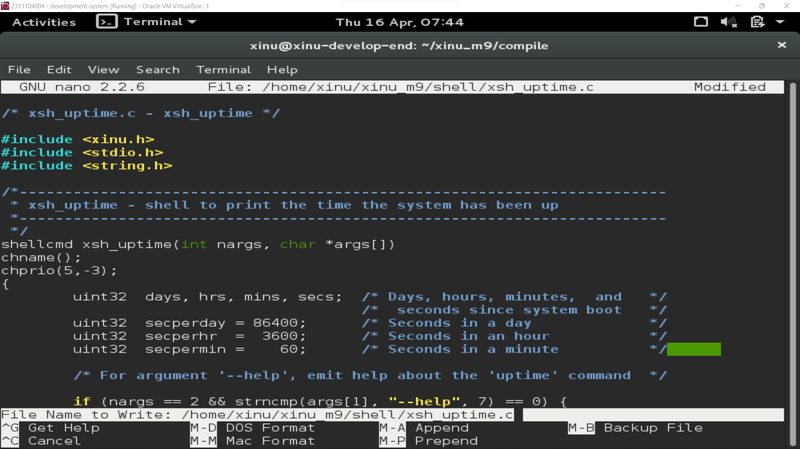

Output:

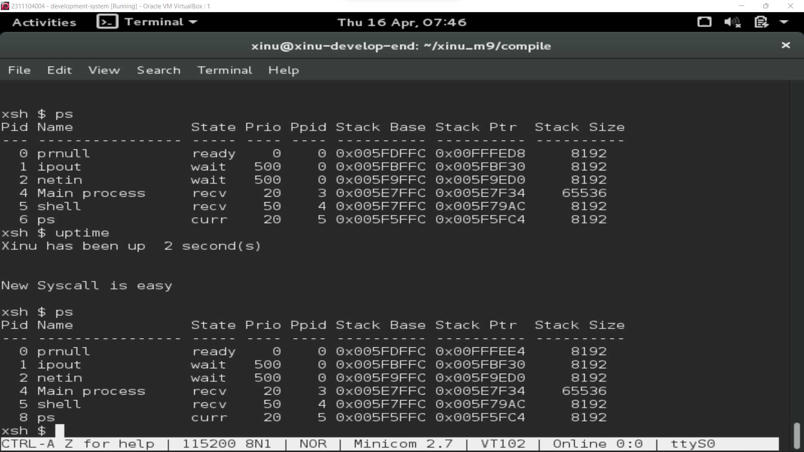

#### 2. PID tidak valid

```c
chprio(3000,3);
```
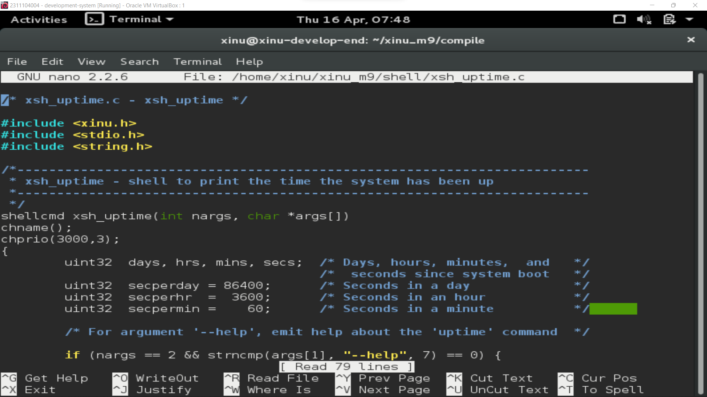

Output:


---

## Referensi

1. Modul Praktikum Sistem Operasi – Modul 9: Syscall
2. Operating System Concepts – Silberschatz